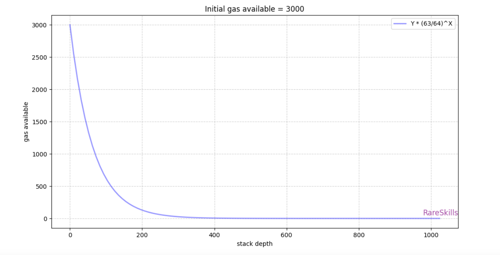

# EIP-150

增加了一些操作码的gas消耗，提出了外部调用最多消耗父调用的1/64的gas，我们就只分析后者。

## 问题所在

在以前，父调用可以将所有分配给它的gas给子调用，那么，这就可能无穷无尽的调用其他合约。以太坊的stack最大深度为1024，达到这一深度的调用则失败。那么就会存在这个情况：黑客不断外部调用，使得stack深度去到1023，然后下一步进行攻击，下面是一个例子：

```solidity
pragma solidity ^0.8.0;

// DO NOT USE!!!
contract Auction {
    address highestBidder;
    uint256 highestBid;

    function bid() external payable {
        if (msg.value < highestBid) revert();

        if (highestBidder != address(0)) {
            // send是外部调用，使得stack达到1024深度，调用失败
            payable(highestBidder).send(highestBid); // refund previous bidder
        }
        // 但是下面的调用会继续，因为send()调用失败退出之后，程序执行流继续接管，stack又回到1023
        highestBidder = msg.sender;
        highestBid = msg.value;
    }
}

contract Hacker{
    uint256 public count = 0;

    function attack(Auction _addr) public payable  {
        while (true){
            if(count < 1022){
                // this的调用算外部调用，递归自己达到1022层，然后进行攻击
                this.attack{value: msg.value}(_addr); 
                count++;
            }else{ // count达到1022的时候，也就是stack去到了1022，再进行一次外部调用，
                // 这时进入到bid()的时候，stack达到了1023，则进行任何外部调用都会失败
                _addr.bid();
                break;
            }
        }
        
    }
}
```

这会成功，其实就是越过了`msg.value < highestBid`的判断，然后实际发送`send()`并没有成功

## 解决问题

为了解决这个不断增加stack深度进行的stack深度攻击，提出了这个想法：每一个子调用最多消耗父调用的63/64，也就是说父调用至少要留下1/64回到原程序流执行下去，数学公式这么表示：

```
  Reserved portion of the available gas
= available gas at Stack depth N - [(63/64) * available gas at Stack depth N]
```

举个例子：

```
Assume; available gas at Stack depth 0 = 1000
Reserved portion of the available gas  = 1000  - ((63/64) * 1000) = 15
```

然后我们模拟一下达到1024层的情况：

```
Gas available at Stack depth 0  = Initial gas available * (63/64)^0
Gas available at Stack depth 1  = Initial gas available * (63/64)^1
Gas available at Stack depth 2  = Initial gas available * (63/64)^2
Gas available at Stack depth 3  = Initial gas available * (63/64)^3
.
.
.
Gas available at Stack depth N  = Initial gas available * (63/64)^N
```

带入实际的数值：

```
Assume; Initial gas available = 3000
Gas available at Stack depth 10 = 3000*(63/64) ^ 10
Gas available at Stack depth 20 =3000*(63/64 ) ^ 20
```

下图是大致各层级stack的gas可使用量：虽然是初始值是3000的图，但是换成其他值也是相同的道理。200层之前，曲线急剧下降，使得子调用可用gas变得很少，大概降到初始gas的1/100。因此一般情况下，是很难让stack深度去到1024的，事实上一般最大调用深度大约为340，这个1024层的限制没有被取消，旨在减轻依赖调用的任何潜在的DoS 攻击的二次复杂度 。




