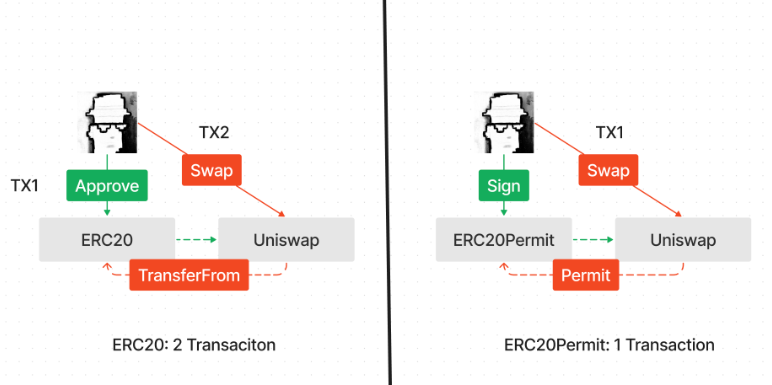

# EIP-2612

## 简述

ERC20是以太坊最流行的代币标准。它流行的一个主要原因是 `approve` 和 `transferFrom` 两个函数搭配使用，使得代币不仅可以在外部拥有账户（EOA）之间转移，还可以被其他合约使用。但是，ERC20的 `approve` 函数限制了只有代币所有者才能调用，这意味着所有 `ERC20` 代币的初始操作必须由 `EOA` 执行。举个例子，用户 A 在去中心化交易所使用 `USDT` 交换 `ETH`，必须完成两个交易：第一步用户 A 调用 `approve` 将 `USDT` 授权给合约，第二步用户 A 调用合约进行交换。非常麻烦，并且用户必须持有 `ETH` 用于支付交易的 gas。

EIP-2612 提出了 ERC20Permit，扩展了 ERC20 标准，添加了一个 `permit` 函数，允许用户通过 EIP-712 签名修改授权，而不是通过 `msg.sender`。这有两点好处：

1. 授权这步仅需用户在链下签名，减少一笔交易。
2. 签名后，用户可以委托第三方进行后续交易，不需要持有 ETH：用户 A 可以将签名发送给 拥有gas的第三方 B，委托 B 来执行后续交易。



## 接口

- `permit()`: 根据 `owner` 的签名, 将 `owenr` 的ERC20代币余额授权给 `spender`，数量为 `value`。要求：
  - `spender` 不能是零地址。
  - `deadline` 必须是未来的时间戳。
  - `v`，`r` 和 `s` 必须是 `owner` 对 EIP712 格式的函数参数的有效 `secp256k1` 签名。
  - 签名必须使用 `owner` 当前的 nonce。
- `nonces()`: 返回 `owner` 的当前 nonce。每次为 `permit()` 函数生成签名时，都必须包括此值。每次成功调用 `permit()` 函数都会将 `owner` 的 nonce 增加 1，防止多次使用同一个签名。
- `DOMAIN_SEPARATOR()`: 返回用于编码 `permit()` 函数的签名的域分隔符（domain separator），如 EIP712所定义。

```solidity
// SPDX-License-Identifier: MIT
pragma solidity ^0.8.0;

/**
 * @dev ERC20 Permit 扩展的接口，允许通过签名进行批准，如 https://eips.ethereum.org/EIPS/eip-2612[EIP-2612]中定义。
 */
interface IERC20Permit {
    /**
     * @dev 根据owner的签名, 将 `owenr` 的ERC20余额授权给 `spender`，数量为 `value`
     */
    function permit(
        address owner,
        address spender,
        uint256 value,
        uint256 deadline,
        uint8 v,
        bytes32 r,
        bytes32 s
    ) external;

    /**
     * @dev 返回 `owner` 的当前 nonce。每次为 {permit} 生成签名时，都必须包括此值。
     */
    function nonces(address owner) external view returns (uint256);

    /**
     * @dev 返回用于编码 {permit} 的签名的域分隔符（domain separator）
     */
    // solhint-disable-next-line func-name-mixedcase
    function DOMAIN_SEPARATOR() external view returns (bytes32);
}
```

## 实现

[openzeppelin的实现](https://github.com/OpenZeppelin/openzeppelin-contracts/blob/master/contracts/token/ERC20/extensions/ERC20Permit.sol)。

```solidity
pragma solidity ^0.8.20;

import {IERC20Permit} from "./IERC20Permit.sol";
import {ERC20} from "../ERC20.sol";
import {ECDSA} from "../../../utils/cryptography/ECDSA.sol";
import {EIP712} from "../../../utils/cryptography/EIP712.sol";
import {Nonces} from "../../../utils/Nonces.sol";

/**
 * @dev Implementation of the ERC20 Permit extension allowing approvals to be made via signatures, as defined in
 * https://eips.ethereum.org/EIPS/eip-2612[EIP-2612].
 */
abstract contract ERC20Permit is ERC20, IERC20Permit, EIP712, Nonces {
    bytes32 private constant PERMIT_TYPEHASH =
        keccak256("Permit(address owner,address spender,uint256 value,uint256 nonce,uint256 deadline)");

    error ERC2612ExpiredSignature(uint256 deadline);

    error ERC2612InvalidSigner(address signer, address owner);

    /**
     * @dev Initializes the {EIP712} domain separator using the `name` parameter, and setting `version` to `"1"`.
     *
     * It's a good idea to use the same `name` that is defined as the ERC20 token name.
     */
    constructor(string memory name) EIP712(name, "1") {}

    function permit(
        address owner,
        address spender,
        uint256 value,
        uint256 deadline,
        uint8 v,
        bytes32 r,
        bytes32 s
    ) public virtual {
        if (block.timestamp > deadline) {
            revert ERC2612ExpiredSignature(deadline);
        }

        bytes32 structHash = keccak256(abi.encode(PERMIT_TYPEHASH, owner, spender, value, _useNonce(owner), deadline));

        bytes32 hash = _hashTypedDataV4(structHash);

        address signer = ECDSA.recover(hash, v, r, s);
        if (signer != owner) {
            revert ERC2612InvalidSigner(signer, owner);
        }

        _approve(owner, spender, value);
    }

    function nonces(address owner) public view virtual override(IERC20Permit, Nonces) returns (uint256) {
        return super.nonces(owner);
    }

    function DOMAIN_SEPARATOR() external view virtual returns (bytes32) {
        return _domainSeparatorV4();
    }
}
```


