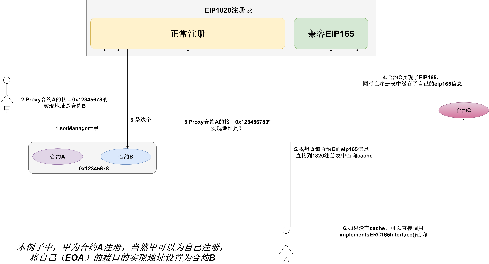

# EIP-1820

## 简述

ERC1820标准定义了一个通用注册表合约，任何地址（合约或普通用户帐户）都可以注册它支持的接口，以及哪个智能合约负责接口实现。ERC1820标准向后兼容 ERC165 。



## 特点 

- ERC1820标准定义任何地址可以向注册表发布其实现了哪些功能（普通用户帐户通过代理合约实现）
- 任何人都可以查询此注册表，询问哪个地址是否实现了给定的接口以及哪个智能合约处理实现逻辑。
- ERC1820注册表合约可以部署在任何链上，并在所有链上的地址是相同的。
- 接口的后28个字节都为0的话，会认为是 ERC165 接口，并且注册表将调用合约以查看是否实现了接口。
- 此合约还充当 ERC165 缓存，以减少 gas 消耗。

## 标准

```solidity
pragma solidity 0.5.3;
// https://eips.ethereum.org/EIPS/eip-1820

/// @dev 如果合约为其他的地址实现了接口， 则必须实现这个接口。
interface ERC1820ImplementerInterface {
    /// @notice 指示合约是否为地址 “addr” 实现接口 “interfaceHash”。
    /// @param interfaceHash 接口名称的 keccak256 哈希值
    /// @param addr 为哪一个地址实现接口
    /// @return 只有当合约为地址'addr'实现'interfaceHash'时返回 ERC1820_ACCEPT_MAGIC
    function canImplementInterfaceForAddress(bytes32 interfaceHash, address addr) external view returns(bytes32);
}


/// @title ERC1820 伪自省注册表合约
/// @notice 该合约是ERC1820注册表的官方实现。
contract ERC1820Registry {
    /// @notice ERC165 无效 ID.
    bytes4 constant internal INVALID_ID = 0xffffffff;
    /// @notice ERC165 的 supportsInterface 接口ID (= `bytes4(keccak256('supportsInterface(bytes4)'))`).
    bytes4 constant internal ERC165ID = 0x01ffc9a7;
    /// @notice 如果合约代表某个其他地址实现接口，则返回Magic值。
    bytes32 constant internal ERC1820_ACCEPT_MAGIC = keccak256(abi.encodePacked("ERC1820_ACCEPT_MAGIC"));

    /// @notice 映射地址及接口到对应的实现合约地址
    mapping(address => mapping(bytes32 => address)) internal interfaces;
    /// @notice 映射地址到管理者
    mapping(address => address) internal managers;
    /// @notice 每个地址和erc165接口的flag，指示是否被缓存。
    mapping(address => mapping(bytes4 => bool)) internal erc165Cached;

    /// @notice 表示合约是'addr'的'interfaceHash'的'实现者'。
    event InterfaceImplementerSet(address indexed addr, bytes32 indexed interfaceHash, address indexed implementer);
    /// @notice 表示'newManager'是'addr'的新管理者的地址。
    event ManagerChanged(address indexed addr, address indexed newManager);

    /// @notice 查询地址是否实现了接口以及通过哪个合约实现的。
    /// @param _addr 查询地址（如果'_addr'是零地址，则假定为'msg.sender'）。
    /// @param _interfaceHash 查询接口，它是接口名称字符串的 keccak256 哈希值
    /// 例如: 'web3.utils.keccak256("ERC777TokensRecipient")' 表示 'ERC777TokensRecipient' 接口.
    /// @return 返回实现者的地址，没有实现返回 ‘0’
    function getInterfaceImplementer(address _addr, bytes32 _interfaceHash) external view returns (address) {
        address addr = _addr == address(0) ? msg.sender : _addr;
        if (isERC165Interface(_interfaceHash)) {
            bytes4 erc165InterfaceHash = bytes4(_interfaceHash);
            return implementsERC165Interface(addr, erc165InterfaceHash) ? addr : address(0);
        }
        return interfaces[addr][_interfaceHash];
    }

    /// @notice 设置某个地址的接口由哪个合约实现，需要由管理员来设置。（每个地址是他自己的管理员，直到设置了一个新的地址）。
    /// @param _addr 待设置的关联接口的地址（如果'_addr'是零地址，则假定为'msg.sender'）
    /// @param _interfaceHash 接口，它是接口名称字符串的 keccak256 哈希值
    /// 例如: 'web3.utils.keccak256("ERC777TokensRecipient")' 表示 'ERC777TokensRecipient' 接口。
    /// @param _implementer 为地址'_addr'实现了 '_interfaceHash'接口的合约地址
    function setInterfaceImplementer(address _addr, bytes32 _interfaceHash, address _implementer) external {
        address addr = _addr == address(0) ? msg.sender : _addr;
        require(getManager(addr) == msg.sender, "Not the manager");

        require(!isERC165Interface(_interfaceHash), "Must not be an ERC165 hash");
        if (_implementer != address(0) && _implementer != msg.sender) {
            require(
                ERC1820ImplementerInterface(_implementer)
                    .canImplementInterfaceForAddress(_interfaceHash, addr) == ERC1820_ACCEPT_MAGIC,
                "Does not implement the interface"
            );
        }
        interfaces[addr][_interfaceHash] = _implementer;
        emit InterfaceImplementerSet(addr, _interfaceHash, _implementer);
    }

    /// @notice 为地址_addr 设置新的管理员地址_newManager， 新的管理员能给'_addr' 调用 'setInterfaceImplementer' 设置是实现者。
    ///  (传 '0x0' 为地址_addr 重置管理员)

    function setManager(address _addr, address _newManager) external {
        require(getManager(_addr) == msg.sender, "Not the manager");
        managers[_addr] = _newManager == _addr ? address(0) : _newManager;
        emit ManagerChanged(_addr, _newManager);
    }

    /// @notice 获取地址 _addr的管理员
    function getManager(address _addr) public view returns(address) {
        // By default the manager of an address is the same address
        if (managers[_addr] == address(0)) {
            return _addr;
        } else {
            return managers[_addr];
        }
    }

    /// @notice 计算给定名称的接口的keccak256哈希值。
    function interfaceHash(string calldata _interfaceName) external pure returns(bytes32) {
        return keccak256(abi.encodePacked(_interfaceName));
    }

    // --- ERC165 相关方法 //

    /// @notice 更新合约是否实现了ERC165接口的缓存。
    function updateERC165Cache(address _contract, bytes4 _interfaceId) external {
        interfaces[_contract][_interfaceId] = implementsERC165InterfaceNoCache(
            _contract, _interfaceId) ? _contract : address(0);
        erc165Cached[_contract][_interfaceId] = true;
    }

    /// @notice 检查合约是否实现ERC165接口。
    //  如果未缓存结果，则对合约地址进行查找。 如果结果未缓存或缓存已过期，则必须通过使用合约地址调用“updateERC165Cache”手动更新缓存。
    /// @param _contract 要检查的合约地址。
    /// @param _interfaceId 要检查ERC165接口。
    /// @return True 如果合约实现了接口返回 true, 否则false.
    function implementsERC165Interface(address _contract, bytes4 _interfaceId) public view returns (bool) {
        if (!erc165Cached[_contract][_interfaceId]) {
            return implementsERC165InterfaceNoCache(_contract, _interfaceId);
        }
        return interfaces[_contract][_interfaceId] == _contract;
    }

    /// @notice 在不使用或更新缓存的情况下检查合约是否实现ERC165接口。
    /// @param _contract 要检查的合约地址。
    /// @param _interfaceId 要检查ERC165接口。
    /// @return True 如果合约实现了接口返回 true, 否则false.
    function implementsERC165InterfaceNoCache(address _contract, bytes4 _interfaceId) public view returns (bool) {
        uint256 success;
        uint256 result;

        (success, result) = noThrowCall(_contract, ERC165ID);
        if (success == 0 || result == 0) {
            return false;
        }

        (success, result) = noThrowCall(_contract, INVALID_ID);
        if (success == 0 || result != 0) {
            return false;
        }

        (success, result) = noThrowCall(_contract, _interfaceId);
        if (success == 1 && result == 1) {
            return true;
        }
        return false;
    }

    /// @notice 检查_interfaceHash 是否是ERC165接口（以28个零结尾）。
    /// @param _interfaceHash 要检查接口 hash。
    /// @return  如果 '_interfaceHash'是ERC165接口返回 True, 否则返回false
    function isERC165Interface(bytes32 _interfaceHash) internal pure returns (bool) {
        return _interfaceHash & 0x00000000FFFFFFFFFFFFFFFFFFFFFFFFFFFFFFFFFFFFFFFFFFFFFFFFFFFFFFFF == 0;
    }

    /// @dev 调用合约接口，如果函数不存在也不抛出异常。
    function noThrowCall(address _contract, bytes4 _interfaceId)
        internal view returns (uint256 success, uint256 result)
    {
        bytes4 erc165ID = ERC165ID;

        assembly {
            let x := mload(0x40)               // Find empty storage location using "free memory pointer"
            mstore(x, erc165ID)                // Place signature at beginning of empty storage
            mstore(add(x, 0x04), _interfaceId) // Place first argument directly next to signature

            success := staticcall(
                30000,                         // 30k gas
                _contract,                     // To addr
                x,                             // Inputs are stored at location x
                0x24,                          // Inputs are 36 (4 + 32) bytes long
                x,                             // Store output over input (saves space)
                0x20                           // Outputs are 32 bytes long
            )

            result := mload(x)                 // Load the result
        }
    }
}
```

## 部署

脚本位于[GitHub](https://github.com/chen4903/eip1820-deploy-example/tree/master)

- 任何链上部署注册表合约的原始交易，必须使用这个calldata发送rawTransaction进行部署：`0xf90a388085174876e80....8201820`。交易结尾的“1820”的字符串是签名的 `r` 和 `s` 。这是人为产生的确定性模式，任何人都可以推断出部署账号而又没有人知道私钥。
- 合约使用无密钥部署方法进行部署，详细信息，请参阅[Nick的文章](https://medium.com/@weka/how-to-send-ether-to-11-440-people-187e332566b7)）。 签名还原出来的地址是`0xa990077c3205cbDf861e17Fa532eeB069cE9fF96`，但是没有人知道他的私钥，因此这是安全的

```
v: 27,
r: 0x1820182018201820182018201820182018201820182018201820182018201820'
s: 0x1820182018201820182018201820182018201820182018201820182018201820'
```

- 部署出来的注册表地址永远是`0x1820a4B7618BdE71Dce8cdc73aAB6C95905faD24`。并且由于需要`0xa990077c3205cbDf861e17Fa532eeB069cE9fF96`来部署，因此在发送rawTransaction之前，需要发送一点钱到账户，建议金额是 0.08 ether

> 通过这个交易只能部署出来注册表合约，没有人可以将这个地址部署成其他内容。原因：没有人知道部署者的私钥，因此nonce永远是0。签名逆向推导出这个部署者的，签名的内容是部署合约。因此，这个calldata只会部署一次，并且内容确定。

## 原理阐述

该标准为任何类型的地址（外部用户地址和合约）提供了一种实现接口的方法，并可能将接口的实现委托给代理合约。 委托给代理合约对于用户帐户地址是必要的，并且有助于避免重新部署如多签和DAO之类的现有合约。

注册表合约还可以充当[ERC165](https://learnblockchain.cn/docs/eips/eip-165.html)缓存，以便在查找合约实现特定[ERC165](https://learnblockchain.cn/docs/eips/eip-165.html)接口时节省Gas。 此实现特意保持缓存简单，因此没有自动缓存更新或失效机制。

任何人都可以通过调用`updateERC165Cache`函数轻松安全地更新任何接口和任何合约的缓存。

使用依赖于一次性部署地址的无密钥部署方法部署注册表，以确保没有人控制注册表，

