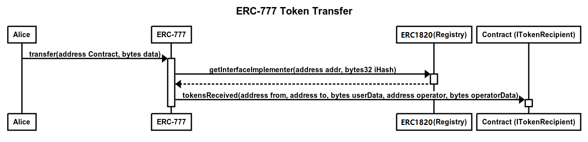
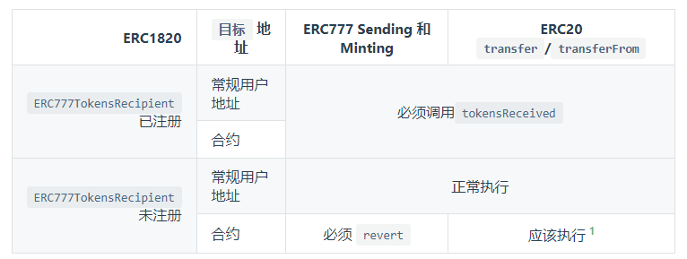

# EIP-777

## 简介

ERC777和ERC20是同一类，是代币标准，但是ERC777表示他比ERC20更加的安全、功能更多。

以太坊上面的ERC777：

- VRA：https://etherscan.io/address/0xf411903cbc70a74d22900a5de66a2dda66507255
- AMP：https://etherscan.io/address/0xff20817765cb7f73d4bde2e66e067e58d11095c2
- LUKSO：https://etherscan.io/address/0xa8b919680258d369114910511cc87595aec0be6d
- SKL：https://etherscan.io/address/0x00c83aecc790e8a4453e5dd3b0b4b3680501a7a7
- imBTC：https://etherscan.io/address/0x3212b29e33587a00fb1c83346f5dbfa69a458923
- CWEB：https://etherscan.io/address/0x505b5eda5e25a67e1c24a2bf1a527ed9eb88bf04
- FLUX：https://etherscan.io/address/0x469eda64aed3a3ad6f868c44564291aa415cb1d9

## 特点

- 配合EIP-1820使用
- 具备钩子函数：
  - 使用 `tokensToSend` 钩子，合约和用户地址都可以控制和拒绝发送出去的token。
  - 使用 `tokensReceived `钩子，合约和用户地址都可以控制和拒绝接收到的token。

- 钩子允许接收token，并在交易中心发出通知。而ERC20需要`approve/transferFrom` 两次调用才能达到这样的效果。token持有人可以指定/去除操作员（合约）地址，这些操作员通常是已经验证过的合约contract，例如交易所，支票处理器或自动收费系统。
- 钩子函数可以通过代理合约来部署，所以ERC777是与ERC20钱包兼容的
- 每一笔交易含有 `data` 和 `operatorData` ，它们是bytes字段，在token持有人和操作员之间传递信息。
- 操作员帐户（通常是智能合约地址），该帐户将能够代表其持有者转让token。如果不打算在token中使用操作员（合约），则只需传递一个空数组即可。

## 工作过程



- ERC777 使用 `send` 转账时，会分别在持有者和接收者地址上使用 ERC1820 的 getInterfaceImplementer 函数进行查询，查看是否有对应的实现合约，ERC777 标准规范里预定了接口及函数名称，如果有实现则进行相应的调用。

### Hook

- ERC777 使用 `operatorSend` 转账时，可以通过参数`operatorData`携带操作者的信息，发送代币除了执行对应账户的余额加减和触发事件之外，还有**额外的规定**：
  1. 如果持有者有通过 ERC1820 注册 `ERC777TokensSender` 实现接口，代币合约必须调用其 `tokensToSend` 钩子函数。
  2. 如果接收者有通过 ERC1820 注册 `ERC777TokensRecipient` 实现接口， 代币合约必须调用其 `tokensReceived` 钩子函数。
  3. 如果有 `tokensToSend` 钩子函数，必须在修改余额状态之前调用。
  4. 如果有 `tokensReceived` 钩子函数，必须在修改余额状态之后调用。
  5. 调用钩子函数及触发事件时，`data` 和 `operatorData`必须原样传递，因为 tokensToSend 和 tokensReceived 函数可能根据这个数据取消转账（触发 `revert`）。

PS：EIP-1820不做重点，可以去看相关的内容



### 例子

ERC20 代币只是在转账过程中更新余额，但 ERC777 代币是这样做的：

1. 对代币发起者的地址进行 Hook 调用
2. 更新余额
3. 对代币接收方地址进行 Hook 调用

这在 [VRA 代币](https://etherscan.io/address/0xf411903cbc70a74d22900a5de66a2dda66507255#code)中得到了很好的说明：

```solidity
    function transfer(address recipient, uint256 amount) public override returns (bool) {
        require(recipient != address(0), "ERC777: transfer to the zero address");

        address from = _msgSender();
		// 对代币发起者的地址进行 Hook 调用
        _callTokensToSend(from, from, recipient, amount, "", "");
		// 更新余额
        _move(from, from, recipient, amount, "", "");
		// 对代币接收方地址进行 Hook 调用
        _callTokensReceived(from, from, recipient, amount, "", "", false);

        return true;
    }
```

这个函数从_ERC1820_REGISTRY 中读取称为 implementer（实现者）的合约。如果该函数找到了一个实现者，那么这个实现者就会被调用。

```solidity
    function _callTokensToSend(
        address operator,
        address from,
        address to,
        uint256 amount,
        bytes memory userData,
        bytes memory operatorData
    )
        private
    {
        address implementer = _ERC1820_REGISTRY.getInterfaceImplementer(from, _TOKENS_SENDER_INTERFACE_HASH);
        if (implementer != address(0)) {
            IERC777Sender(implementer).tokensToSend(operator, from, to, amount, userData, operatorData);
        }
    }
```

received也是同理

```solidity
    function _callTokensReceived(
        address operator,
        address from,
        address to,
        uint256 amount,
        bytes memory userData,
        bytes memory operatorData,
        bool requireReceptionAck
    )
        private
    {
        address implementer = _ERC1820_REGISTRY.getInterfaceImplementer(to, _TOKENS_RECIPIENT_INTERFACE_HASH);
        if (implementer != address(0)) {
            IERC777Recipient(implementer).tokensReceived(operator, from, to, amount, userData, operatorData);
        } else if (requireReceptionAck) {
            require(!to.isContract(), "ERC777: token recipient contract has no implementer for ERC777TokensRecipient");
        }
    }
```

## ERC777 标准规范

### 接口

接口定义在 [openzeppelin代码库](https://github.com/OpenZeppelin/openzeppelin-contracts) 里找到，路径为：` contracts/token/ERC777/IERC777.sol` 。

```solidity
interface ERC777Token {
    function name() external view returns (string memory);
    function symbol() external view returns (string memory);
    function totalSupply() external view returns (uint256);
    function balanceOf(address holder) external view returns (uint256);

    // 定义代币最小的划分粒度，固定值为18，相当于ERC20的decimal
    function granularity() external view returns (uint256);

    // 操作员 相关的操作（操作员是可以代表持有者发送和销毁代币的账号地址）
    function defaultOperators() external view returns (address[] memory);
    function isOperatorFor(
        address operator,
        address holder
    ) external view returns (bool);
    function authorizeOperator(address operator) external;
    function revokeOperator(address operator) external;

    // 发送代币
    function send(address to, uint256 amount, bytes calldata data) external;
    function operatorSend(
        address from,
        address to,
        uint256 amount,
        bytes calldata data,
        bytes calldata operatorData
    ) external;

    // 销毁代币
    function burn(uint256 amount, bytes calldata data) external;
    function operatorBurn(
        address from,
        uint256 amount,
        bytes calldata data,
        bytes calldata operatorData
    ) external;

    // 发送代币事件
    event Sent(
        address indexed operator,
        address indexed from,
        address indexed to,
        uint256 amount,
        bytes data,
        bytes operatorData
    );

    // 铸币事件
    event Minted(
        address indexed operator,
        address indexed to,
        uint256 amount,
        bytes data,
        bytes operatorData
    );

    // 销毁代币事件
    event Burned(
        address indexed operator,
        address indexed from,
        uint256 amount,
        bytes data,
        bytes operatorData
    );

    // 授权操作员事件
    event AuthorizedOperator(
        address indexed operator,
        address indexed holder
    );

    // 撤销操作员事件
    event RevokedOperator(address indexed operator, address indexed holder);
}
```

### 遵守的约定

所有的ERC777 合约除了必须实现上述接口，还有一些其他的必须遵守的约定。

ERC777 合约必须要通过 ERC1820 注册 `ERC777Token` 接口，这样任何人都可以查询合约是否是ERC777标准的合约，注册方法是: 调用ERC1820 注册合约的 `setInterfaceImplementer()` 

如果 ERC777 要实现ERC20标准，还必须通过ERC1820 注册`ERC20Token`接口。

#### Operator

ERC777 定义了一个操作员角色，操作员可以移动代币。

默认操作员需遵守以下规则：

- 代币合约必须在创建时设置默认操作员。
- 默认操作员是不可变的，任何时候不可以添加和删除。
- 设置默认操作员不能触发 `AuthorizedOperator` 事件。
- 持有者必须允许撤销默认操作员，除非默认操作员本身就是持有者。
- 持有者必须允许重新授权之前的默认操作员。
- 当默认操作员被显示的授权或撤销，需要相应的触发 `AuthorizedOperator` 或 `RevokedOperator` 事件
- 默认操作员是被所有持有人授权的操作员，这可以为项目方管理代币带来方便，当然任何持有人仍然有权撤销默认操作员

任何操作员需遵守的规则：

- 每个地址都是其自身的操作员，因此不能被撤销。
- 如果地址是某个持有者的操作员, isOperatorFor 返回 true ，否则返回 false .
- 触发AuthorizedOperator 事件，要确保参数正确。参考`AuthorizedOperator` 事件
- 触发 RevokedOperator 事件，要确保参数正确。参考`RevokedOperator` 事件

#### 发送代币

ERC777 发送代币 使用以下两个方法：

```solidity
send(address to, uint256 amount, bytes calldata data) external

function operatorSend(
    address from,
    address to,
    uint256 amount,
    bytes calldata data,
    bytes calldata operatorData
) external
```

特点：

- 如果持有者有通过 ERC1820 注册 `ERC777TokensSender` 实现接口， 代币合约必须调用其 `tokensToSend` 钩子函数。
- 如果接收者有通过 ERC1820 注册 `ERC777TokensRecipient` 实现接口， 代币合约必须调用其 `tokensReceived` 钩子函数。

#### 铸币与销毁

ERC777 没有定义铸币的方法名，只定义了 Minted事件，因为很多代币，是在创建的时候就确定好代币的数量。如果有需要合约可以自己定义铸币函数，铸币函数在实现时要求：

1. 必须触发Minted事件
2. 发行量需要加上铸币量， 接收者是不为 0 ，且接收者余额加上铸币量。
3. 如果接收者有通过 ERC1820 注册 ERC777TokensRecipient 实现接口， 代币合约必须调用其 tokensReceived 钩子函数。

ERC777 定义了两个函数用于销毁代币 (`burn` 和 `operatorBurn`)。`burn` 和 `operatorBurn` 的实现要求：

1. 必须触发Burned事件。
2. 总供应量必须减少代币销毁量， 持有者的余额必须减少代币销毁的数量。
3. 如果持有者通过ERC1820注册ERC777TokensSender 实现，必须调用持有者的tokensToSend钩子函数。

> 注意，零个代币数量的交易（不管是转移、铸币与销毁）也是合法的

## ERC777 代币实现

OpenZeppelin 实现了一个 ERC777 基础合约，要实现自己的ERC777代币只需要继承 OpenZeppelin ERC777。

nodejs工程可以使用以下方式安装 OpenZeppelin 合约库：

```bash
npm install @openzeppelin/contracts
```

发行一个 2100 个的 LBC7 代币的代码就很简单了：

```solidity
pragma solidity ^0.5.0;

import "@openzeppelin/contracts/token/ERC777/ERC777.sol";

contract MyERC777 is ERC777 {
    constructor(
        address[] memory defaultOperators
    )
        ERC777("MyERC777", "LBC7", defaultOperators)
        public
    {
        uint initialSupply = 2100 * 10 ** 18;
        _mint(msg.sender, msg.sender, initialSupply, "", "");
    }
}
```

## 总结

只看这些是懵懵懂懂的，去看一下[OZ的实现](https://github.com/OpenZeppelin/openzeppelin-contracts/blob/v4.9.0/contracts/token/ERC777/ERC777.sol)，就能够理解大概的原理了。


