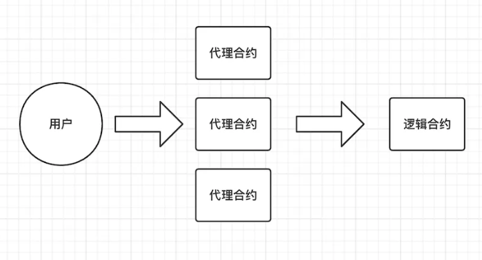
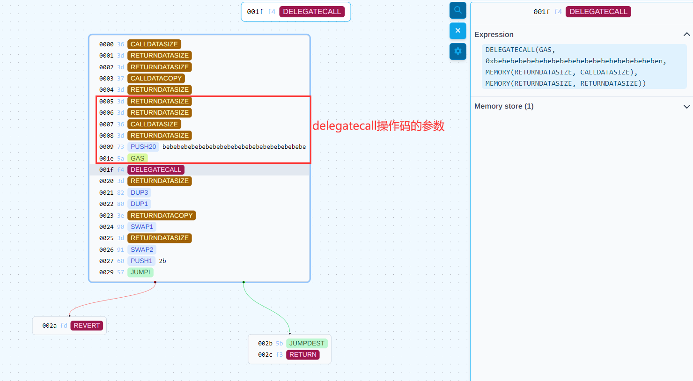
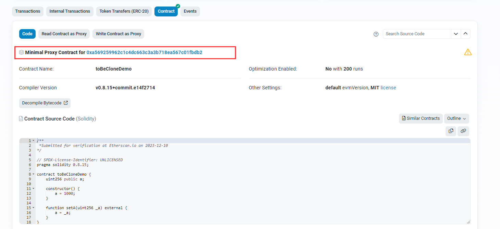

# EIP-1167

## 简介

`EIP-1167`，又称 `Minimal Proxy Contract`，提供了一种低成本复制合约的方法。它有什么意义呢？我们先来看个例子：

```solidity
function createPair(address tokenA, address tokenB) external returns (address pair) {
    require(tokenA != tokenB, 'UniswapV2: IDENTICAL_ADDRESSES');
    (address token0, address token1) = tokenA < tokenB ? (tokenA, tokenB) : (tokenB, tokenA);
    require(token0 != address(0), 'UniswapV2: ZERO_ADDRESS');
    require(getPair[token0][token1] == address(0), 'UniswapV2: PAIR_EXISTS'); // single check is sufficient
    bytes memory bytecode = type(UniswapV2Pair).creationCode;
    bytes32 salt = keccak256(abi.encodePacked(token0, token1));
    // 通过原始 bytecode 创建合约
    assembly {
        pair := create2(0, add(bytecode, 32), mload(bytecode), salt)
    }
    IUniswapV2Pair(pair).initialize(token0, token1);
    getPair[token0][token1] = pair;
    getPair[token1][token0] = pair; // populate mapping in the reverse direction
    allPairs.push(pair);
    emit PairCreated(token0, token1, pair, allPairs.length);
}
```

在 Uniswap v2 的工厂合约中，需要创建交易对合约，这里的方法是直接使用交易对合约，即 `UniswapV2Pair` 合约的 `creationCode` 进行创建。由于是创建原始的合约内容，因此有一个缺点就是耗费的 gas 取决于 `Pair` 合约的大小，`Pair` 合约的内容越多，耗费的 gas 越多。

那么有没有什么改进方法呢？答案是有的：使用代理模式。

## 原理

### 架构

整个架构中存在 N 个代理合约和一个逻辑合约，有多套数据分别存储在不同的代理合约中，所有代理合约共享逻辑合约的执行逻辑，同一时间存在多个代理合约。

`Minimal Proxy Contract` 的原理就是将代理合约作为逻辑合约的复制品，各个代理合约存储各自的数据，需要多少份复制品就创建多少个代理合约即可。而代理合约本身只负责请求转发，因此其内容很少，从而耗费更少的 gas。



### 例子

我们来看一个例子（注意这里是为了简单起见直接使用了构造函数，实际应用中不应该使用构造函数，因为这部分不会在代理合约中运行，即不会被初始化。因此如果有初始化逻辑，需要放在 `initialize` 函数中额外调用）：

```solidity
// SPDX-License-Identifier: UNLICENSED
pragma solidity 0.8.15;

contract Demo {
    uint256 public a;

    constructor() {
        a = 1000;
    }

    function setA(uint256 _a) external {
        a = _a;
    }
}
```

现在我们要对这个 `Demo` 合约进行复制，可以借助 [OZ](https://github.com/OpenZeppelin/openzeppelin-contracts/blob/master/contracts/proxy/Clones.sol) 的 `Clones` 合约来完成：

```solidity
// SPDX-License-Identifier: MIT
// OpenZeppelin Contracts v4.4.1 (proxy/Clones.sol)

pragma solidity ^0.8.0;
library Clones {
    /**
     * @dev Deploys and returns the address of a clone that mimics the behaviour of `implementation`.
     *
     * This function uses the create opcode, which should never revert.
     */
    function clone(address implementation) internal returns (address instance) {
        assembly {
            let ptr := mload(0x40)
            mstore(ptr, 0x3d602d80600a3d3981f3363d3d373d3d3d363d73000000000000000000000000)
            mstore(add(ptr, 0x14), shl(0x60, implementation))
            mstore(add(ptr, 0x28), 0x5af43d82803e903d91602b57fd5bf30000000000000000000000000000000000)
            instance := create(0, ptr, 0x37)
        }
        require(instance != address(0), "ERC1167: create failed");
    }
    ///....
}
```

`clone` 方法需要接受一个原始逻辑合约的地址，然后返回新生成的克隆合约（也就是我们上面说的代理合约）地址。

我们来看看上面代码是什么意思：

-  `let ptr := mload(0x40)` ：获取内存中空闲内存指针的位置
-  `mstore(ptr, 0x3d602d80600a3d3981f33…)`：将该数据存入内存中
- `shl(0x60, implementation)`：将地址左移 `0x60`，即 `96` 位，得到实际的`implementation`地址

> 由于 `address` 类型实际只占用 20 个字节，而传入的参数是通过 0 补齐到 32 字节的。
>
> 假设传入的地址是`0xbebebebebebebebebebebebebebebebebebebebe`，则补齐的内容为：`0x000000000000000000000000bebebebebebebebebebebebebebebebebebebebe`，左移 `96` 位之后恰好获得原始的地址数据。

- `mstore(add(ptr, 0x14), shl(0x60, implementation))`：存储到`mstore(ptr, 0x3d602d80600a3d3981f33…)`之后的位置，因为0x14是20字节。

- `mstore(add(ptr, 0x28), 0x5af43d828....)`：将 `0x5af43d82803e903d…` 拼接到前面的数据所在内存位置后面
- `instance := create(0, ptr, 0x37)`：创建合约

三个 `mstore` 操作下来，此时内存中的数据为：

```
3d602d80600a3d3981f3363d3d373d3d3d363d73
bebebebebebebebebebebebebebebebebebebebe
5af43d82803e903d91602b57fd5bf3

[3d602d80600a3d3981f3363d3d373d3d3d363d73bebebebebebebebebebebebebebebebebebebebe5af43d82803e903d91602b57fd5bf3]
```

首先我们将前 `10` 个字节 `3d602d80600a3d3981f3` 的含义是如下：即克隆合约的构造方法，内容是将整个克隆合约的字节码返回给 EVM。

| position | OPCODE         | content |
| -------- | -------------- | ------- |
| [00]     | RETURNDATASIZE |         |
| [01]     | PUSH1          | 2d      |
| [03]     | DUP1           |         |
| [04]     | PUSH1          | 0a      |
| [06]     | RETURNDATASIZE |         |
| [07]     | CODECOPY       |         |
| [08]     | DUP2           |         |
| [09]     | RETURN         |         |

再将后面的 `45` 字节数据 `363d3d373d3d3d363d73bebebebebebebebebebebebebebebebebebebebe5af43d82803e903d91602b57fd5bf3` 反编译：这部分内容是利用 `delegatecall` 将调用进行转发的逻辑。

```solidity
function function_selector() public payable { 
    CALLDATACOPY(RETURNDATASIZE(), RETURNDATASIZE(), msg.data.length);
    v0 = 0xbebebebebebebebebebebebebebebebebebebebe.delegatecall(MEM[(RETURNDATASIZE()) len msg.data.length], MEM[(RETURNDATASIZE()) len (RETURNDATASIZE())]).gas(msg.gas);
    RETURNDATACOPY(RETURNDATASIZE(), RETURNDATASIZE(), RETURNDATASIZE());
    require(v0, RETURNDATASIZE(), RETURNDATASIZE());
    return MEM[(RETURNDATASIZE()) len (RETURNDATASIZE())];
}
```



## 实践

代码

```solidity
// SPDX-License-Identifier: UNLICENSED
pragma solidity 0.8.15;

library Clones {

    function clone(address implementation) internal returns (address instance) {
        assembly {
            let ptr := mload(0x40)
            mstore(ptr, 0x3d602d80600a3d3981f3363d3d373d3d3d363d73000000000000000000000000)
            mstore(add(ptr, 0x14), shl(0x60, implementation))
            mstore(add(ptr, 0x28), 0x5af43d82803e903d91602b57fd5bf30000000000000000000000000000000000)
            instance := create(0, ptr, 0x37)
        }
        require(instance != address(0), "ERC1167: create failed");
    }

}

contract toBeCloneDemo {
    uint256 public a;

    constructor() {
        a = 1000;
    }

    function setA(uint256 _a) external {
        a = _a;
    }
}

contract MyClonesFactory {
    using Clones for address;

    event ProxyGenerated(address proxy);

    function clone(address _implementation) external {
        address proxy = _implementation.clone();
        emit ProxyGenerated(proxy);
    }
}
```

步骤：

1. 部署toBeCloneDemo：[0xa569259962c1c4dc663C3a3B718Ea567C01FbDB2](https://holesky.etherscan.io/tx/0x7f0efb43ab387b27da918ceccbfa51d8983007bb1739cc6f8693f6b2142b4ff9)
2. 部署MyClonesFactory：[0x8013eA61E653d87aa93b7e2a38E6f7EBFE3045Af](https://holesky.etherscan.io/tx/0x6b70c6fb12c36e3dcd7eceac3168e67cbc6c70541fc3ac54c553a39943981675)
3. 使用克隆创建合约：[0x1356d4076b37cb59dd43a838dd210da6fda9d93eb2783cc57157071d08929f8e](https://holesky.etherscan.io/tx/0x1356d4076b37cb59dd43a838dd210da6fda9d93eb2783cc57157071d08929f8e)。注意：克隆合约是通过内部交易创建的，在MyClonesFactory的Internal Transactions中可以找到。

Etherscan 也已经支持了 `EIP-1167` 的合约验证，只要原始合约代码已经验证，那么克隆合约代码自动验证。


