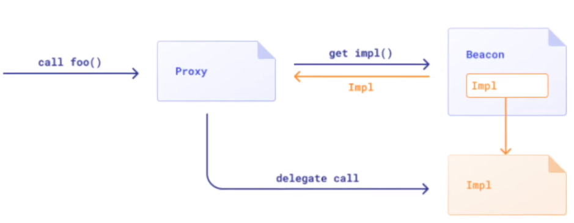

# EIP-1967

## 简介

EIP-1967是对EIP-1822的进一步标准化版本。

### 前言

通常来讲，合约存储状态变量都是从0插槽位置开始存储的，这样的话，如果代理定义了一个状态变量，实现合约也定义了一个不同的状态变量，都从0插槽开始存储，在操作时势必共享插槽位置引起冲突。

因此，解决这种冲突的办法就是主合约（Proxy）尽量不定义状态变量，所有的状态变量都在实现合约中定义，这样就解决这个冲突问题了，但主合约至少要定义一个实现合约地址的状态变量，例如为`implement`。

同时，为了防止任何人都可以升级合约设置新的implement，Proxy合约还需要一个admin状态变量，这样，通常意义上，Proxy 合约会有两个状态变量，如果默认的从0插槽位置开始存储，就会发生上面所说的冲突，怎么解决呢？

进一步的解决办法就是指定Proxy合约的两个状态变量的插槽位置，不再是默认的0和1。

那我们给`admin`和`implement` 这两个状态变量指定哪个位置（索引）的插槽比较合适呢？通常来讲，这个插槽索引不能太小，否则也会引起冲突。因此，就有了诸如`bytes32(uint256(keccak256('eip1967.proxy.implementation')) - 1)`得到slot的方式。

### slot位置

**设计原因1**

选择`keccak256('eip1967.proxy.implementation') - 1`的原因是为了避免潜在的攻击。如果想阅读以下的讨论，请先行阅读[Understanding Ethereum Smart Contract Storage](https://programtheblockchain.com/posts/2018/03/09/understanding-ethereum-smart-contract-storage/)中的`mapping`部分。

为了方便理解，我将进行一次对某智能合约的假想攻击。

假设当前存在一份使用`keccak256("PROXIABLE")`的值作为逻辑合约存储槽的代理合约。且作为攻击者的我们通过阅读逻辑合约源代码发现在逻辑合约内存在`mapping`数据结构。

我们已知在合约内`mapping`数据结构存储在`keccak256(key, slot)`的地址内，且`key`和`slot`拼接方式已知。显然，我们可以阅读代理合约的代码或存储的状态变量得到`slot`的值，一般而言我们也可以通过交互合约操作`key`的值。如果满足上述条件，我们可以构造一种特殊的`key`和`slot`的拼接使其值等于`PROXIABLE`实现将逻辑合约存储槽写入特定的`value`。在代理合约内一般仅存在`fallback`等函数，一旦逻辑合约地址被改变，则资金无法转移。这是极其严重的事故。但在`EIP-1967`中。

使用了`keccak256('eip1967.proxy.implementation') - 1`导致无法在简单地使用`mapping`的`keccak256(key, slot)`存储槽进行占用。除非你可以将`keccak256('eip1967.proxy.implementation') - 1`转换为`keccak256(x)`的形式。但基于哈希函数的不可逆性，我们无法计算出`x`的值，导致无法构造攻击用的`(slot, key)`。

**设计原因2**

在`EIP-1822`中我们一般采用`keccak256("PROXIABLE")`值，即`0xc5f16f0fcc639fa48a6947836d9850f504798523bf8c9a3a87d5876cf622bcf7`，该值其实可以有开发者自行决定。但在`EIP-1967`中，为了方便区块链浏览器的访问，该地址被标准化为`keccak256('eip1967.proxy.implementation') - 1`，即`0x360894a13ba1a3210667c828492db98dca3e2076cc3735a920a3ca505d382bbc`。

## 原理




- Proxy合约

  - 作用：存储实际的数据

- implementation合约

  - slot：0x360894a13ba1a3210667c828492db98dca3e2076cc3735a920a3ca505d382bbc

    > bytes32(uint256(keccak256('eip1967.proxy.implementation')) - 1)

  - 作用：实际的合约逻辑

- 管理员

  - slot：0xb53127684a568b3173ae13b9f8a6016e243e63b6e8ee1178d6a717850b5d6103

    > bytes32(uint256(keccak256('eip1967.proxy.admin')) - 1)

  - 作用：管理合约升级功能等

- beacon合约

  - slot：0xa3f0ad74e5423aebfd80d3ef4346578335a9a72aeaee59ff6cb3582b35133d50

    > bytes32(uint256(keccak256('eip1967.proxy.beacon')) - 1)

  - 作用：同一Impl合约可以实现多个Proxy合约共同代理。

    - 这就引起了一些疑问了，有人会说：我不需要这个beacon合约，也可以实现这个功能呀，所有的Proxy合约中存储相同Impl的地址，这样所有的Proxy合约都是用同一套逻辑了。
    - 但是这会引起一个问题：如果Impl合约需要升级，那么就要所有的Proxy合约调用类似`setImpl()`这样的方法更新Impl地址，这显然是不好的。因此我们使用beacon合约解决这个问题。
    - 拥有beacon合约的调用关系如下所示。如果我们需要升级Impl，获得到了一个新的Impl地址，那么只需要做的就是：将beancon中的Impl修改即可，而所有的Proxy合约无需做任何事情，因此也叫透明升级。


```
Traces:
  [20126] ContractTest::testInit() 
    ├─ [13293] BeaconProxy::name() 
    │   ├─ [2308] UpgradeableBeacon::implementation() [staticcall]
    │   │   └─ ← NFTImplementation: [0xce71065d4017f316ec606fe4422e11eb2c47c246]
    │   ├─ [3191] NFTImplementation::name() [delegatecall]
    │   │   └─ ← "TEST"
    │   └─ ← "TEST"
    └─ ← ()
```

触发事件列表

| 事件名称       | 事件代码                                                     | 触发条件         |
| -------------- | ------------------------------------------------------------ | ---------------- |
| Upgraded       | `event Upgraded(address indexed implementation);`            | 逻辑合约地址升级 |
| BeaconUpgraded | `event BeaconUpgraded(address indexed beacon);`              | 信标代理合约升级 |
| AdminChanged   | `event AdminChanged(address previousAdmin, address newAdmin);` | 合约拥有者改变   |

## 实现

```solidity
// SPDX-License-Identifier: UNLICENSED
pragma solidity ^0.8.13;

library StorageSlot {
    struct AddressSlot {
        address value;
    }

    struct BooleanSlot {
        bool value;
    }

    struct Bytes32Slot {
        bytes32 value;
    }

    struct Uint256Slot {
        uint256 value;
    }

    function getAddressSlot(bytes32 slot) internal pure returns (AddressSlot storage r) {
        assembly {
            r.slot := slot
        }
    }

    function getBooleanSlot(bytes32 slot) internal pure returns (BooleanSlot storage r) {
        assembly {
            r.slot := slot
        }
    }

    function getBytes32Slot(bytes32 slot) internal pure returns (Bytes32Slot storage r) {
        assembly {
            r.slot := slot
        }
    }

    function getUint256Slot(bytes32 slot) internal pure returns (Uint256Slot storage r) {
        assembly {
            r.slot := slot
        }
    }
}

abstract contract ERC1967Upgrade {
    // This is the keccak-256 hash of "eip1967.proxy.rollback" subtracted by 1
    bytes32 private constant _ROLLBACK_SLOT = 0x4910fdfa16fed3260ed0e7147f7cc6da11a60208b5b9406d12a635614ffd9143;

    /**
     * @dev Storage slot with the address of the current implementation.
     * This is the keccak-256 hash of "eip1967.proxy.implementation" subtracted by 1, and is
     * validated in the constructor.
     */
    bytes32 internal constant _IMPLEMENTATION_SLOT = 0x360894a13ba1a3210667c828492db98dca3e2076cc3735a920a3ca505d382bbc;

    event Upgraded(address indexed implementation);

    function _getImplementation() internal view returns (address) {
        return StorageSlot.getAddressSlot(_IMPLEMENTATION_SLOT).value;
    }

    function _setImplementation(address newImplementation) private {
        require(Address.isContract(newImplementation), "ERC1967: new implementation is not a contract");
        StorageSlot.getAddressSlot(_IMPLEMENTATION_SLOT).value = newImplementation;
    }

    function _upgradeTo(address newImplementation) internal {
        _setImplementation(newImplementation);
        emit Upgraded(newImplementation);
    }

    function _upgradeToAndCall(
        address newImplementation,
        bytes memory data,
        bool forceCall
    ) internal {
        _upgradeTo(newImplementation);
        if (data.length > 0 || forceCall) {
            Address.functionDelegateCall(newImplementation, data);
        }
    }

    function _upgradeToAndCallSecure(
        address newImplementation,
        bytes memory data,
        bool forceCall
    ) internal {
        address oldImplementation = _getImplementation();

        // Initial upgrade and setup call
        _setImplementation(newImplementation);
        if (data.length > 0 || forceCall) {
            Address.functionDelegateCall(newImplementation, data);
        }

        // Perform rollback test if not already in progress
        StorageSlot.BooleanSlot storage rollbackTesting = StorageSlot.getBooleanSlot(_ROLLBACK_SLOT);
        if (!rollbackTesting.value) {
            // Trigger rollback using upgradeTo from the new implementation
            rollbackTesting.value = true;
            Address.functionDelegateCall(
                newImplementation,
                abi.encodeWithSignature("upgradeTo(address)", oldImplementation)
            );
            rollbackTesting.value = false;
            // Check rollback was effective
            require(oldImplementation == _getImplementation(), "ERC1967Upgrade: upgrade breaks further upgrades");
            // Finally reset to the new implementation and log the upgrade
            _upgradeTo(newImplementation);
        }
    }

    /**
     * @dev Storage slot with the admin of the contract.
     * This is the keccak-256 hash of "eip1967.proxy.admin" subtracted by 1, and is
     * validated in the constructor.
     */
    bytes32 internal constant _ADMIN_SLOT = 0xb53127684a568b3173ae13b9f8a6016e243e63b6e8ee1178d6a717850b5d6103;

    event AdminChanged(address previousAdmin, address newAdmin);

    function _getAdmin() internal view returns (address) {
        return StorageSlot.getAddressSlot(_ADMIN_SLOT).value;
    }

    function _setAdmin(address newAdmin) private {
        require(newAdmin != address(0), "ERC1967: new admin is the zero address");
        StorageSlot.getAddressSlot(_ADMIN_SLOT).value = newAdmin;
    }

    function _changeAdmin(address newAdmin) internal {
        emit AdminChanged(_getAdmin(), newAdmin);
        _setAdmin(newAdmin);
    }

    /**
     * @dev The storage slot of the UpgradeableBeacon contract which defines the implementation for this proxy.
     * This is bytes32(uint256(keccak256('eip1967.proxy.beacon')) - 1)) and is validated in the constructor.
     */
    bytes32 internal constant _BEACON_SLOT = 0xa3f0ad74e5423aebfd80d3ef4346578335a9a72aeaee59ff6cb3582b35133d50;

    event BeaconUpgraded(address indexed beacon);

    function _getBeacon() internal view returns (address) {
        return StorageSlot.getAddressSlot(_BEACON_SLOT).value;
    }

    function _setBeacon(address newBeacon) private {
        require(Address.isContract(newBeacon), "ERC1967: new beacon is not a contract");
        require(
            Address.isContract(IBeacon(newBeacon).implementation()),
            "ERC1967: beacon implementation is not a contract"
        );
        StorageSlot.getAddressSlot(_BEACON_SLOT).value = newBeacon;
    }

    function _upgradeBeaconToAndCall(
        address newBeacon,
        bytes memory data,
        bool forceCall
    ) internal {
        _setBeacon(newBeacon);
        emit BeaconUpgraded(newBeacon);
        if (data.length > 0 || forceCall) {
            Address.functionDelegateCall(IBeacon(newBeacon).implementation(), data);
        }
    }
}

abstract contract Proxy {
    function _delegate(address implementation) internal virtual {
        assembly {
            // Copy msg.data. We take full control of memory in this inline assembly
            // block because it will not return to Solidity code. We overwrite the
            // Solidity scratch pad at memory position 0.
            calldatacopy(0, 0, calldatasize())

            // Call the implementation.
            // out and outsize are 0 because we don't know the size yet.
            let result := delegatecall(gas(), implementation, 0, calldatasize(), 0, 0)

            // Copy the returned data.
            returndatacopy(0, 0, returndatasize())

            switch result
            // delegatecall returns 0 on error.
            case 0 {
                revert(0, returndatasize())
            }
            default {
                return(0, returndatasize())
            }
        }
    }

    function _implementation() internal view virtual returns (address);

    function _fallback() internal virtual {
        _beforeFallback();
        _delegate(_implementation());
    }

    fallback() external payable virtual {
        _fallback();
    }

    receive() external payable virtual {
        _fallback();
    }

    function _beforeFallback() internal virtual {}
}

contract ERC1967Proxy is Proxy, ERC1967Upgrade {
    constructor(address _logic, bytes memory _data) payable {
        assert(_IMPLEMENTATION_SLOT == bytes32(uint256(keccak256("eip1967.proxy.implementation")) - 1));
        _upgradeToAndCall(_logic, _data, false);
    }

    function _implementation() internal view virtual override returns (address impl) {
        return ERC1967Upgrade._getImplementation();
    }
}
```

另外，可以看一下OZ的实现。


