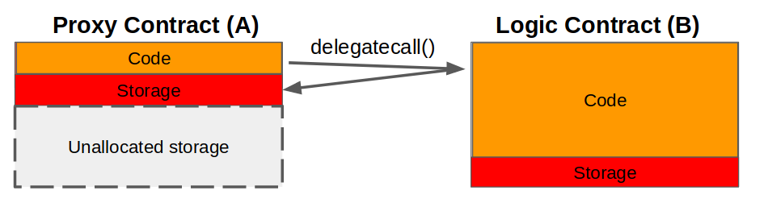

# EIP-1822

## 简介

是对EIP-897的升级，解决了slot冲突的问题，也是使用delegatecall实现的。

| slot                                                         | Proxy Contract        | Impl Contract        |
| ------------------------------------------------------------ | --------------------- | -------------------- |
| 0                                                            |                       | state variable1      |
| 1                                                            |                       | state variable2      |
| ...                                                          |                       | .....                |
| 0xc5f16f0fcc639fa48a6947836d9850f504798523bf8c9a3a87d5876cf622bcf7 | Impl Contract Address | 理论上不可能的存储值 |

通过上述存储表，我们可以明显看出逻辑合约在运行时可以向小于`0xc5f16f0fcc639fa48a6947836d9850f504798523bf8c9a3a87d5876cf622bcf7`的任一存储槽写入数据而不导致存储冲突。

## 架构

- Proxy Contract: 
- Logic Contract: 
- Proxiable Contract: 被Logic Contract继承，提供升级功能



## 原理

### Proxy

在此处，我们给出该思路的核心部分:

```solidity
contract Proxy {
    // Code position in storage is keccak256("PROXIABLE") = "0xc5f16f0fcc639fa48a6947836d9850f504798523bf8c9a3a87d5876cf622bcf7"
    constructor(bytes memory constructData, address contractLogic) public {
        // save the code address
        assembly { // solium-disable-line
            sstore(0xc5f16f0fcc639fa48a6947836d9850f504798523bf8c9a3a87d5876cf622bcf7, contractLogic)
        }
        (bool success, bytes memory _ ) = contractLogic.delegatecall(constructData); // solium-disable-line
        require(success, "Construction failed");
    }

    function() external payable {
        assembly { // solium-disable-line
            let contractLogic := sload(0xc5f16f0fcc639fa48a6947836d9850f504798523bf8c9a3a87d5876cf622bcf7)
            calldatacopy(0x0, 0x0, calldatasize)
            let success := delegatecall(sub(gas, 10000), contractLogic, 0x0, calldatasize, 0, 0)
            let retSz := returndatasize
            returndatacopy(0, 0, retSz)
            switch success
            case 0 {
                revert(0, retSz)
            }
            default {
                return(0, retSz)
            }
        }
    }
}
```

构造函数接受两个参数，`constructData`和`contractLogic`。前者是逻辑合约的构造器函数的选择器，后者是逻辑合约的地址。`assembly`部分使用了`sstore`实现了将地址存储到`0xc5f16f0fcc639fa48a6947836d9850f504798523bf8c9a3a87d5876cf622bcf7`地址的功能。然后使用`delegatecall`函数调用`constructData`，即逻辑合约的构造函数实现对逻辑合约构造。

> constructData类似initialization()这样的方法一样，进行合约的初始化

### Proxiable

根据标准，所有基于`EIP-1822`的合约都应该实现此合约，此合约的目的是保存向后兼容。合约内容非常简单，在`updateCodeAddress(address)`升级函数中要求新合约的`proxiableUUID`为`0xc5f16f0fcc639fa48a6947836d9850f504798523bf8c9a3a87d5876cf622bcf7`。

将Logic Contract的地址存储在`keccak256("PROXIABLE")`的slot。

```solidity
contract Proxiable {
    // Code position in storage is keccak256("PROXIABLE") = "0xc5f16f0fcc639fa48a6947836d9850f504798523bf8c9a3a87d5876cf622bcf7"

    function updateCodeAddress(address newAddress) internal {
        require(
            bytes32(
                0xc5f16f0fcc639fa48a6947836d9850f504798523bf8c9a3a87d5876cf622bcf7
            ) == Proxiable(newAddress).proxiableUUID(),
            "Not compatible"
        );
        assembly {
            sstore(
                0xc5f16f0fcc639fa48a6947836d9850f504798523bf8c9a3a87d5876cf622bcf7,
                newAddress
            )
        }
    }

    function proxiableUUID() public pure returns (bytes32) {
        return
            0xc5f16f0fcc639fa48a6947836d9850f504798523bf8c9a3a87d5876cf622bcf7;
    }
}
```

## 例子

### owned合约

```solidity
contract Owned is Proxiable {
    // ensures no one can manipulate this contract once it is deployed
    address public owner = address(1);

    function constructor1() public{
        // ensures this can be called only once per *proxy* contract deployed
        require(owner == address(0));
        owner = msg.sender;
    }

    function updateCode(address newCode) onlyOwner public {
        updateCodeAddress(newCode);
    }

    modifier onlyOwner() {
        require(msg.sender == owner, "Only owner is allowed to perform this action");
        _;
    }
}
```

### Proxy合约

```solidity
pragma solidity ^0.5.1;

contract Proxy {
    // Code position in storage is keccak256("PROXIABLE") = "0xc5f16f0fcc639fa48a6947836d9850f504798523bf8c9a3a87d5876cf622bcf7"
    constructor(bytes memory constructData, address contractLogic) public {
        // save the code address
        assembly { // solium-disable-line
            sstore(0xc5f16f0fcc639fa48a6947836d9850f504798523bf8c9a3a87d5876cf622bcf7, contractLogic)
        }
        (bool success, bytes memory _ ) = contractLogic.delegatecall(constructData); // solium-disable-line
        require(success, "Construction failed");
    }

    function() external payable {
        assembly { // solium-disable-line
            let contractLogic := sload(0xc5f16f0fcc639fa48a6947836d9850f504798523bf8c9a3a87d5876cf622bcf7)
            calldatacopy(0x0, 0x0, calldatasize)
            let success := delegatecall(sub(gas, 10000), contractLogic, 0x0, calldatasize, 0, 0)
            let retSz := returndatasize
            returndatacopy(0, 0, retSz)
            switch success
            case 0 {
                revert(0, retSz)
            }
            default {
                return(0, retSz)
            }
        }
    }
}
```

### Impl合约

```solidity
contract Proxiable {
    // Code position in storage is keccak256("PROXIABLE") = "0xc5f16f0fcc639fa48a6947836d9850f504798523bf8c9a3a87d5876cf622bcf7"

    function updateCodeAddress(address newAddress) internal {
        require(
            bytes32(0xc5f16f0fcc639fa48a6947836d9850f504798523bf8c9a3a87d5876cf622bcf7) == Proxiable(newAddress).proxiableUUID(),
            "Not compatible"
        );
        assembly { // solium-disable-line
            sstore(0xc5f16f0fcc639fa48a6947836d9850f504798523bf8c9a3a87d5876cf622bcf7, newAddress)
        }
    }
    function proxiableUUID() public pure returns (bytes32) {
        return 0xc5f16f0fcc639fa48a6947836d9850f504798523bf8c9a3a87d5876cf622bcf7;
    }
}


contract Owned {

    address owner;

    function setOwner(address _owner) internal {
        owner = _owner;
    }
    modifier onlyOwner() {
        require(msg.sender == owner, "Only owner is allowed to perform this action");
        _;
    }
}

contract LibraryLockDataLayout {
  bool public initialized = false;
}

contract LibraryLock is LibraryLockDataLayout {
    // Ensures no one can manipulate the Logic Contract once it is deployed.
    // PARITY WALLET HACK PREVENTION

    modifier delegatedOnly() {
        require(initialized == true, "The library is locked. No direct 'call' is allowed");
        _;
    }
    function initialize() internal {
        initialized = true;
    }
}

contract ERC20DataLayout is LibraryLockDataLayout {
  uint256 public totalSupply;
  mapping(address=>uint256) public tokens;
}

contract ERC20 {
    //  ...
    function transfer(address to, uint256 amount) public {
        require(tokens[msg.sender] >= amount, "Not enough funds for transfer");
        tokens[to] += amount;
        tokens[msg.sender] -= amount;
    }
}

contract MyToken is ERC20DataLayout, ERC20, Owned, Proxiable, LibraryLock {

    function constructor1(uint256 _initialSupply) public {
        totalSupply = _initialSupply;
        tokens[msg.sender] = _initialSupply;
        initialize();
        setOwner(msg.sender);
    }
    function updateCode(address newCode) public onlyOwner delegatedOnly  {
        updateCodeAddress(newCode);
    }
    function transfer(address to, uint256 amount) public delegatedOnly {
        ERC20.transfer(to, amount);
    }
}
```


