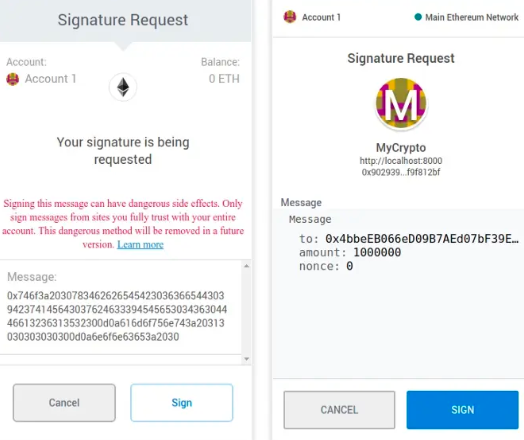

# EIP-191

## 简介

这个EIP提议了一个关于如何在以太坊合约中处理签名数据的详细说明。

- EIP191编码是为了定义智能合约中签名数据的格式
- EIP712是EIP191的一种
- EIP712解决了重放攻击和结构体编码规范的问题

简单点来说就是添加了"`\x19Ethereum Signed Message:\n`"这个字符串的签名，添加这个字符串只是单纯的为了表明这是以太坊的签名

签名逻辑：

- encodepacked(参数1，参数2，参数3，…)
- -> Hash1=keccak256(encodepacked(参数1，参数2，参数3，…)
- -> keccak256(abi.encodePacked(“\x19Ethereum Signed Message:\n32”, Hash1))
- -> 加入私钥进行运算得到"消息签名”。

## 原理

### 规则

建议采用以下格式签名数据：

```
0x19 <1 byte version> <version specific data> <data to sign>.
```

- 1个1字节的版本号
- 版本号特有的数据
- 签名数据本身
- `0x19`：确保`signed_data`的RLP 无效。

为什么使用0x19作为前缀呢？

以太坊中大量使用了RLP格式编码，为了和RLP编码区分，EIP191采用了0x19作为EIP191数据的前缀。因为RLP编码的数据，如果是0x19作为前缀，其仅代表着一个单字节。不可能像EIP191一样，0x19后面跟着一串数据。因此EIP191数据和RLP编码的数据就能区别开来。

### 变体

有了这个数据格式，人们就会先把数据按照EIP191的格式组装起来，然后进行签名。签名的数据在智能合约中也按照EIP191的格式进行验证。目前一共有三个版本号：

| Version byte | EIP                                                          | Description                  |
| ------------ | ------------------------------------------------------------ | ---------------------------- |
| 0x00         | [191](https://github.com/ethereum/EIPs/blob/master/EIPS/eip-191.md) | Data with intended validator |
| 0x01         | [712](https://github.com/ethereum/EIPs/blob/master/EIPS/eip-712.md) | Structured data              |
| 0x45         | [191](https://github.com/ethereum/EIPs/blob/master/EIPS/eip-191.md) | personal_sign messages       |

#### version 0x00

这种版本的数据格式为：

```
0x19 <0x00> <intended validator address> <data to sign>
```

其中往往是合约地址。这样做的好处是签名仅对某合约有效，一定程度避免重放攻击。

比如你有一段数据“abc“需要签名，在合约地址0xffff中使用，则常见的步骤为：

1. 拼接EIP191数据格式: data=0x19 0x00 0xffff abc
2. 把拼接好的数据做哈希运算：hash = keccak256(data)
3. 签名数据
4. 把数据发送给合约，合约调用ecrecover计算出签名人地址
5. 验证签名人是否合法

#### version 0x45

这种版本的数据格式为：

```
0x19 <0x45 (E)> <thereum Signed Message:\n" + len(message)> <data to sign>
```

注意，0x45对应的ascii编码就是字母E。这个版本其实是把personal_sign方案纳入到了EIP191中。

#### version 0x01

这个版本的就是EIP712。也就是EIP712其实也是EIP191的一种。

## 存在的问题

EIP191有几个问题：

- 没有明确防止重放攻击的规定
- message如果是一个结构体，则没有对应的编码规范，开发者可以按照自己的方式进行编码，造成一些外部组件，比如钱包，无法解析编码

EIP712是EIP191的一种，EIP712就是为了解决以上两个问题：

- 通过DOMAIN_SEPARATOR设定，防止重放攻击
- 规范对结构体编码的方式

左边是EIP191编码，可以看到message是一堆不可读的字符串，右边是EIP712编码，可以知道结构体的具体数据。而是如何做到这一点的，详情去看EIP-712的实现。



## 其他

EIP191中0x00的版本与0x45有什么区别？

这是一个历史原因。一开始并没有EIP191格式，人们常用的是最初由 Geth 实现的 [personal_sign](https://github.com/ethereum/go-ethereum/pull/2940)方案，数据格式为：

```
"\x19Ethereum Signed Message:\n" + length(message) + message
```

而人们往往会对message做哈希运算，因此更常见的格式为：

```
"\x19Ethereum Signed Message:\n32" + Keccak256(message)
```

在这基础之上拓展了EIP191，EIP191是以0x19为前缀，再加一个版本号，personal_sign方案并没有版本号，因此就把第一个字母“E”，作为版本号。


